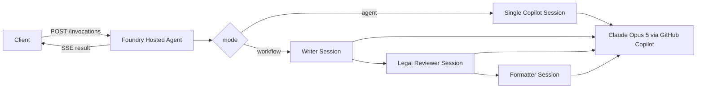

# GitHub Copilot SDK + Microsoft Foundry Hosted Agent 실습

GitHub Copilot SDK로 일반 업무용 Agent와 순차 워크플로를 만들고,
Microsoft Foundry에 Hosted Agent로 배포하는 실습입니다.

사용 모델은 GitHub Copilot이 제공하는 **Claude Opus 5**이며, SDK 모델 ID는
`claude-opus-5`입니다.

> 이 구성에서 Claude Opus 5는 Foundry에 모델로 배포되지 않습니다.
> Foundry는 Agent 코드를 호스팅하고, Agent 내부의 GitHub Copilot SDK가
> GitHub 인증을 사용해 Claude Opus 5를 호출합니다. 모델 사용량과 접근 정책도
> Azure 모델 배포가 아니라 GitHub Copilot 구독 및 조직 정책을 따릅니다.

한국 Foundry Marketplace에서 Claude 모델을 직접 사용할 수 없는 상황의
대안으로 검토한다면 [Copilot SDK 기반 Claude 대안 검토](docs/copilot-sdk-claude-alternative.md)를
먼저 읽으세요. 이 실습이 증명하는 범위와 production 적용 시 필요한 조건을
정리했습니다.

| 목적 | 읽을 문서 |
|---|---|
| 직접 실행하고 배포하기 | 이 `README.md` |
| 고객 적용 가능성과 제약 판단하기 | [Copilot SDK 기반 Claude 대안 검토](docs/copilot-sdk-claude-alternative.md) |

## 한눈에 보기

| 질문 | 답변 |
|---|---|
| Foundry에 Claude를 배포하는가? | 아니요 |
| Claude는 어디서 호출하는가? | GitHub Copilot SDK |
| Foundry의 역할은 무엇인가? | Agent 코드 호스팅, endpoint, 버전, 실행 환경 |
| 예제 Agent는 무엇을 하는가? | AI 솔루션 아키텍트 역할의 질의응답 |
| 예제 워크플로는 무엇을 하는가? | 슬로건 작성 → 법률 검토 → 최종 포맷팅 |
| 한국 리전에서 Claude가 실행되는가? | 보장되지 않음 |
| 권장 용도는 무엇인가? | PoC와 Copilot 라이선스를 가진 고객사의 내부 업무 |

이 프로젝트는 **Foundry의 Claude 모델 endpoint 대체재**가 아니라,
**Foundry Hosted Agent 안에서 Copilot의 Claude를 사용하는 기술 경로**를
보여줍니다.

## 검증 상태

이 리포의 Agent는 2026-08-15에 다음 항목을 실제 확인했습니다.

- Microsoft Foundry Hosted Agent 직접 코드 배포
- Hosted Agent 버전 `active` 상태 확인
- GitHub Copilot의 `claude-opus-5` 모델 호출
- Writer → Legal reviewer → Formatter 원격 워크플로 완료

[Playwright 데모 녹화 보기](foundry-hosted-agent-demo.webm)

## 가장 빠른 실행

다음 명령은 새 Foundry 프로젝트를 만들고 Agent를 배포합니다.

```bash
# 1. 도구와 로그인 확인
azd version
azd extension install microsoft.foundry
az login
azd auth login

# 2. azd 환경 생성
azd env new dev
azd env set AZURE_SUBSCRIPTION_ID "$(az account show --query id -o tsv)"
azd env set AZURE_LOCATION "northcentralus"
azd env set COPILOT_MODEL "claude-opus-5"

# 3. Copilot Requests: Read-only 권한의 fine-grained PAT 설정
read -s GITHUB_TOKEN
azd env set GITHUB_TOKEN "$GITHUB_TOKEN"
unset GITHUB_TOKEN

# 4. Azure 리소스와 Hosted Agent 배포
azd provision --no-state --no-prompt
azd deploy --no-prompt

# 5. 배포 확인과 원격 workflow 실행
azd ai agent show copilot-workflow-hosted --output json
azd ai agent invoke copilot-workflow-hosted \
  --protocol invocations \
  --input-file requests/workflow.json \
  --new-session
```

성공하면 응답에 `"model":"claude-opus-5"`와
`writer`, `legal_reviewer`, `formatter` 단계 결과가 표시됩니다.

> 이 과정은 Azure 리소스 비용과 GitHub Copilot AI Credits를 사용할 수
> 있습니다. 실습 리소스가 더 이상 필요하지 않으면 프로젝트 루트에서
> `azd down`을 실행해 정리하세요.

## 1. 학습 목표

- Copilot SDK의 `CopilotClient`와 session을 Agent로 사용하는 방법
- Agent Framework의 Agent/Workflow 개념을 Copilot SDK로 매핑하는 방법
- `writer → legal reviewer → formatter` 순차 워크플로 구현
- Foundry `invocations` 프로토콜 어댑터 구성
- `azd`를 사용한 로컬 실행, 직접 코드 배포, 원격 호출 및 로그 확인

## 2. 구현 아키텍처



Microsoft Agent Framework와의 개념 대응은 다음과 같습니다.

| Microsoft Agent Framework | GitHub Copilot SDK 구현 |
|---|---|
| `Agent` | `CopilotClient.create_session()` + `system_message` |
| Function tool | `@define_tool` 또는 MCP tool |
| Sequential workflow | 여러 session을 Python 코드로 순서대로 호출 |
| Concurrent workflow | `asyncio.gather()`로 여러 session 병렬 호출 |
| Handoff | Router session이 다음 specialist session을 선택 |
| Magentic/group chat | Manager session + 반복 실행 루프 |
| `context_mode="last_agent"` | 다음 session에 직전 Agent 결과만 전달 |
| Workflow checkpoint | Foundry session ID와 Copilot session ID 저장/복원 |
| Workflow as an agent | Foundry protocol host로 workflow endpoint 노출 |

Copilot SDK 자체에는 Agent Framework의 `WorkflowBuilder`와 동일한 그래프
API가 없습니다. 대신 Copilot의 agent runtime을 각 단계에 사용하고,
워크플로 제어 흐름은 애플리케이션 코드가 담당합니다.

## 3. 프로젝트 구조

```text
.
├── AGENTS.md
├── README.md
├── azure.yaml
├── foundry-hosted-agent-demo.webm
├── docs
│   └── copilot-sdk-claude-alternative.md
├── requests
│   ├── agent.json
│   └── workflow.json
├── src
│   └── copilot-workflow-hosted
│       ├── .agentignore
│       ├── .env.example
│       ├── main.py
│       ├── requirements.txt
│       └── workflow.py
└── tests
    └── test_workflow.py
```

## 4. 사전 준비

다음 항목이 필요합니다.

1. Azure 구독
2. Python 3.13
3. Azure Developer CLI(`azd`) 1.31.1 이상
4. `microsoft.foundry` azd extension
5. GitHub Copilot 구독
6. Claude Opus 5 사용이 허용된 개인 또는 조직 정책
7. **Copilot Requests: Read-only** 권한을 가진 GitHub fine-grained PAT

```bash
azd version
azd extension install microsoft.foundry
az login
azd auth login
```

새 Foundry 프로젝트를 만들려면 리소스 그룹 범위의 `Owner` 권한이 필요합니다.
기존 프로젝트에 배포하려면 프로젝트 범위의 `Foundry Project Manager` 권한이
필요합니다.

### Claude Opus 5 접근 확인

GitHub Copilot CLI에서 `/model`을 실행해 **Claude Opus 5**가 표시되는지
확인합니다. Business/Enterprise 환경에서는 관리자가 해당 모델을 먼저
허용해야 할 수 있습니다.

모델을 사용할 수 없을 때 이 예제는 다른 모델로 자동 대체하지 않습니다.
`COPILOT_MODEL=claude-opus-5` 호출이 명시적으로 실패하도록 두어 배포 환경과
로컬 환경의 동작이 달라지는 문제를 방지합니다.

### GitHub 토큰 준비

GitHub의 fine-grained personal access token 생성 화면에서
**Account permissions → Copilot Requests → Read-only**를 선택합니다.

워크숍에서는 다음처럼 토큰을 현재 azd 환경에 저장합니다. 이 방식은 PoC용입니다.
운영 환경에서는 [대안 검토 문서](docs/copilot-sdk-claude-alternative.md)의
사용자별 OAuth 또는 고객 소유 Copilot 조직 방식을 검토하세요.

```bash
azd env new dev
read -s GITHUB_TOKEN
azd env set GITHUB_TOKEN "$GITHUB_TOKEN"
azd env set COPILOT_MODEL "claude-opus-5"
unset GITHUB_TOKEN
```

`.azure/`와 `.env` 파일은 커밋하지 마세요. 운영 환경에서는 장기 PAT보다
짧은 수명의 GitHub App user token과 조직의 secret 관리 방식을 권장합니다.

## 5. 코드 이해

### 5.1 안전한 Copilot runtime

`main.py`는 `CopilotClient(mode="empty")`를 사용합니다.

- 호스트 파일 시스템, shell, 네트워크 도구를 기본 노출하지 않음
- custom instruction과 cross-session memory를 기본 비활성화
- 각 session에서 `available_tools=[]`로 도구 사용을 명시적으로 차단
- `use_logged_in_user=False`로 개발자 개인 로그인 대신 주입된 토큰만 사용

Agent에 도구가 필요하다면 `available_tools=[]`를 제거해 전체 도구를 여는
대신, 필요한 custom/MCP tool만 allowlist로 추가하세요.

### 5.2 단일 Agent

요청의 `mode`가 `agent`이면 한 개의 Copilot session이 요청을 처리합니다.

```json
{
  "input": "생성형 AI 서비스 출시 체크리스트를 만들어줘.",
  "mode": "agent"
}
```

### 5.3 Sequential workflow

요청의 `mode`가 `workflow`이면 다음 세 session이 순차 실행됩니다.

1. `writer`: 주제에 맞는 슬로건 후보 작성
2. `legal_reviewer`: 과장, 보장, 비교우위 표현 검토 및 수정
3. `formatter`: 최종 결과를 읽기 좋은 Markdown으로 정리

각 단계는 직전 단계의 출력만 받습니다. 이는 Agent Framework workflow
샘플의 `context_mode="last_agent"`와 같은 역할입니다.

```json
{
  "input": "합리적인 가격과 재미있는 주행감을 강조하는 전기 SUV",
  "mode": "workflow"
}
```

## 6. 로컬 테스트

### 6.1 순수 workflow 테스트

이 테스트는 실제 모델을 호출하지 않고 단계 연결과 context 전달을 확인합니다.

```bash
python -m unittest discover -s tests -v
```

### 6.2 의존성 설치

```bash
cd src/copilot-workflow-hosted
python -m venv .venv
source .venv/bin/activate
python -m pip install --upgrade pip
python -m pip install -r requirements.txt
python -m copilot download-runtime
cd ../..
```

Windows PowerShell에서는 venv 활성화 명령으로
`.venv\Scripts\Activate.ps1`을 사용합니다.

### 6.3 Hosted Agent 로컬 실행

프로젝트 루트에서 실행합니다.

```bash
azd ai agent run --no-client
```

서버 로그에 `Running on http://0.0.0.0:8088`과 같은 준비 완료 메시지가
표시된 뒤, 다른 터미널에서 호출합니다.

```bash
azd ai agent invoke --local \
  --protocol invocations \
  --input-file requests/agent.json

azd ai agent invoke --local \
  --protocol invocations \
  --input-file requests/workflow.json
```

응답은 SSE(Server-Sent Events) 형식입니다.

```text
event: result
data: {"mode":"workflow","model":"claude-opus-5","output":"..."}

event: done
data: {"invocation_id":"..."}
```

## 7. Microsoft Foundry에 배포

이 예제의 `azure.yaml`은 Python 3.13 **직접 코드 배포**를 사용합니다.
Docker와 ACR build가 필요하지 않습니다.

구독과 리전을 설정합니다.

```bash
azd env set AZURE_SUBSCRIPTION_ID "<subscription-id>"
azd env set AZURE_LOCATION "northcentralus"
```

새 Foundry 프로젝트와 지원 리소스를 프로비전합니다.

```bash
azd provision --no-state --no-prompt
```

이미 준비된 Foundry 프로젝트를 사용할 때는 새 프로젝트를 만들지 말고,
조직의 프로젝트 연결 절차에 따라 해당 프로젝트 ARM ID/endpoint를 azd
환경에 연결한 뒤 배포 단계로 이동합니다.

Hosted Agent를 배포합니다.

```bash
azd deploy --no-prompt
```

배포 상태와 endpoint를 확인합니다.

```bash
azd ai agent show --output json
```

`status`가 `active` 또는 `deployed`인지 확인한 후 원격 호출합니다.

```bash
azd ai agent invoke \
  --protocol invocations \
  --input-file requests/workflow.json
```

로그는 다음 명령으로 확인합니다.

```bash
azd ai agent monitor
azd ai agent monitor --follow
```

원격 호출은 GitHub Copilot 모델 사용량을 소비할 수 있습니다.

## 8. 평가 실습

이 프로젝트는 Claude 추론을 Copilot에서 수행하므로 Foundry model deployment가
없습니다. Foundry 평가 데이터 생성에는 별도의 **Foundry 평가 모델 배포**가
필요합니다. 먼저 평가에 사용할 모델을 Foundry에 배포한 뒤 deployment name을
지정하세요.

```bash
azd ai agent eval generate \
  --gen-instruction "Generate topics that test slogan quality, legal safety, and formatting." \
  --eval-model "<foundry-evaluation-model-deployment>" \
  --no-wait \
  --no-prompt

azd ai agent eval run
azd ai agent eval show -O results.json
```

평가 모델 없이 `eval generate`를 실행하면
`Missing model option parameters in request body` 오류가 발생합니다.

평가 항목 예시는 다음과 같습니다.

| 항목 | 기대 조건 |
|---|---|
| 단계 실행 | writer, legal reviewer, formatter 순서 유지 |
| 법률 안전성 | 보장, 절대적 우위, 검증되지 않은 수치 제거 |
| 출력 형식 | 최종 Markdown 결과 존재 |
| 모델 고정 | 결과 metadata의 model이 `claude-opus-5` |
| 오류 처리 | 빈 입력과 잘못된 mode에 HTTP 400 반환 |

## 9. 확장 과제

### Concurrent workflow

시장 분석 Agent와 고객 분석 Agent를 `asyncio.gather()`로 동시에 실행하고,
마지막 synthesizer Agent가 두 결과를 합치도록 변경합니다.

### Handoff workflow

router Agent가 `billing`, `technical`, `general` 중 하나를 구조화된 결과로
선택하고, 선택된 specialist session만 호출하도록 구현합니다.

### Tools

Copilot SDK의 `@define_tool`로 읽기 전용 상품 카탈로그 조회 도구를 만든 뒤
`available_tools`에 해당 custom tool만 허용합니다.

### Multi-turn session

현재 workflow는 요청마다 새 session을 사용합니다. 대화 연속성이 필요하면
`FOUNDRY_AGENT_SESSION_ID`와 단계 이름으로 Copilot session ID를 만들고,
`resume_session()`을 사용해 단계별 상태를 복원합니다.

## 10. 운영 시 주의점

- `GITHUB_TOKEN`을 코드, 이미지, 로그 또는 Git 저장소에 넣지 마세요.
- Hosted Agent identity와 GitHub token은 서로 다른 인증 경계입니다.
- 사용자별 데이터 격리가 필요하면 session storage도 사용자별로 분리하세요.
- 도구 실행 Agent에서 `PermissionHandler.approve_all`을 운영 기본값으로
  사용하지 마세요.
- `claude-opus-5` 접근 가능 여부는 Copilot plan 및 조직 정책에 따라 다릅니다.
- Copilot 장애와 Foundry hosting 장애를 로그/metric에서 구분하세요.
- 고비용 모델을 사용하는 workflow는 단계 수만큼 모델 호출이 증가합니다.
- GitHub AI Credits가 충분해도 별도의 비공개 rate limit이 적용될 수 있습니다.
- Claude 추론이 한국 Azure region에서 처리된다고 가정하지 마세요.

## 11. 자주 발생하는 문제

### `403 ... agents/read`

현재 `azd`와 Foundry extension을 먼저 업데이트하세요.

```bash
azd version
azd extension install azure.ai.agents --force
azd extension install microsoft.foundry --force
```

그 후 배포 사용자가 Foundry project 범위의 `Foundry User`,
`Foundry Project Manager` 또는 `Foundry Owner` 역할을 갖는지 확인합니다.

### 로컬 포트 8088이 이미 사용 중

```bash
azd ai agent run --no-client --port 8090
azd ai agent invoke --local --port 8090 \
  --protocol invocations \
  --input-file requests/workflow.json
```

### `claude-opus-5`를 사용할 수 없음

Copilot CLI의 `/model` 또는 SDK의 `list_models()`로 모델 가용성을 확인합니다.
Business/Enterprise 조직에서는 관리자가 Claude Opus 5를 허용해야 합니다.

### Python 패키지 다운로드 실패

네트워크 오류가 일시적이면 venv에서 의존성을 먼저 설치한 뒤 다시 실행합니다.

```bash
cd src/copilot-workflow-hosted
python -m pip install --retries 8 --timeout 60 -r requirements.txt
cd ../..
```

## 12. 공식 참고 자료

- [GitHub Copilot SDK](https://github.com/github/copilot-sdk)
- [Copilot Python SDK](https://github.com/github/copilot-sdk/tree/main/python)
- [GitHub Copilot 지원 모델](https://docs.github.com/copilot/reference/ai-models/supported-models)
- [Foundry: Deploy your own code as a hosted agent](https://learn.microsoft.com/azure/foundry/agents/quickstarts/quickstart-deploy-own-code)
- [Foundry GitHub Copilot SDK sample](https://github.com/microsoft-foundry/foundry-samples/tree/main/samples/python/hosted-agents/bring-your-own/invocations/github-copilot)
- [Agent Framework workflow sample](https://github.com/microsoft-foundry/foundry-samples/tree/main/samples/python/hosted-agents/agent-framework/responses/05-workflows)
- [Foundry Hosted Agents](https://learn.microsoft.com/azure/ai-foundry/agents/concepts/hosted-agents)
- [Copilot SDK 기반 Claude 대안 검토](docs/copilot-sdk-claude-alternative.md)
